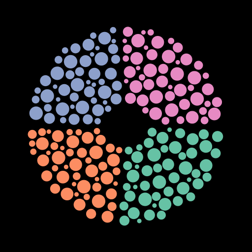

  

This project is an experiment, using d3js and reactjs, of building a new type of Chart.

## Algorithm details

The bubble positioning algorithm is detailed in this [medium article](https://headonkeyboard.medium.com/want-some-bubbles-with-your-donut-chart-7d7790b3468b).

## Try it now

Go to [bubble-donut-chart.vercel.app](https://bubble-donut-chart.vercel.app/) to start playing with Bubble Donut.
